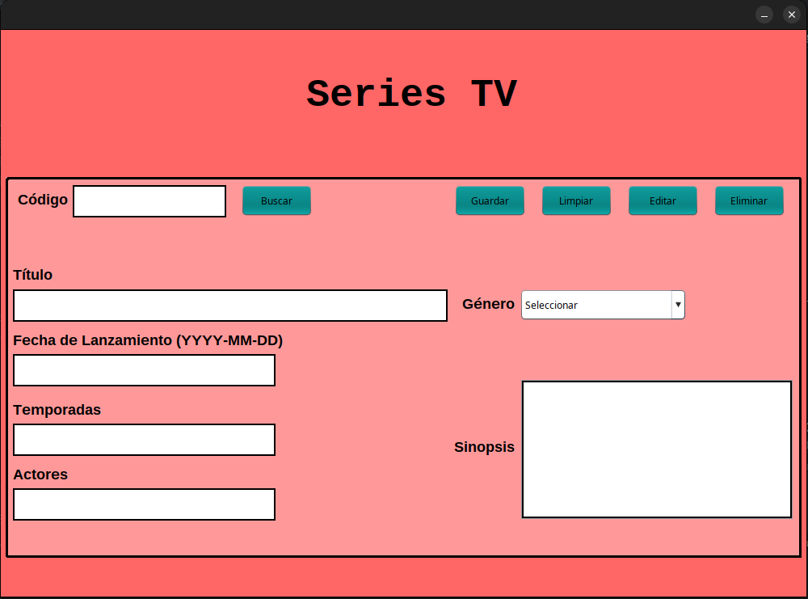

# 📺 SeriesTV - Aplicación de Escritorio en Java

Aplicación de escritorio desarrollada en Java con Swing y conexión a base de datos MySQL. Permite la gestión de un catálogo de series de TV mediante operaciones CRUD (Crear, Leer, Actualizar, Eliminar).

---

## 🚀 Funcionalidades

- 📄 Crear nuevas series
- 🔍 Buscar series por código
- ✏️ Editar la información de una serie existente
- 🗑️ Eliminar series
- 🎨 Interfaz gráfica intuitiva con Java Swing
- 📊 Conexión a base de datos MySQL mediante JDBC

---

## 🛠️ Requisitos

- Java 17 o superior (este proyecto usa Java 21)
- MySQL instalado y ejecutándose
- NetBeans o cualquier IDE compatible con Maven
- Archivo `mysql-connector-j` agregado mediante Maven o manual

---

## 🧱 Estructura del Proyecto

```
seriesTV/
├── src/
│   └── main/
│       └── java/
│           └── seriestv/
│               ├── controller/   # Conexión y lógica de datos
│               ├── model/        # Clase Serie.java
│               └── view/         # Interfaz gráfica
├── serietv.sql                   # Script de base de datos
├── pom.xml                       # Configuración Maven
└── README.md
```

---

## 📦 Instalación y Ejecución

1. Clona este repositorio:
   ```bash
   git clone https://github.com/Andreswill/SeriesTV-JavaApp.git
   ```

2. Abre el proyecto en NetBeans o tu IDE preferido.

3. Asegúrate de tener MySQL activo y haber importado el archivo `serietv.sql`.

4. Ajusta los datos de conexión en `Conexion.java`:
   ```java
   private static final String URL = "jdbc:mysql://localhost:3306/serietv";
   private static final String USER = "root";
   private static final String PASSWORD = "";
   ```

5. Ejecuta la clase `Vista.java` para iniciar la aplicación.

---

## 🧪 Vista de la Aplicación


```markdown

```

---

## 📄 Licencia

Este proyecto fue desarrollado con fines educativos como parte de una actividad académica integradora.

---

## 👨‍💻 Autor

**Andreswill**  
📧 juniorpachecop321@gmail.com  
📆 2025
